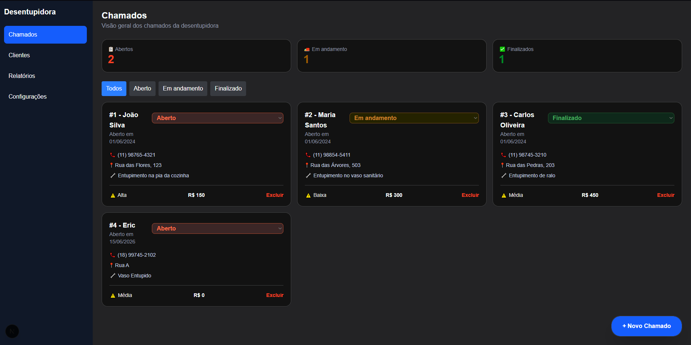

# Drain Cleaning Service SaaS

A fullstack operational management system for drain cleaning companies and field service providers, built with a focus on modern architecture, security, scalability, and user experience.



## Status

🚧 In Development

## Implemented

- Initial Next.js project structure
- Initial dashboard
- Base application layout
- Prototype screenshots

## Planned Features

- Node.js backend
- JWT authentication
- PostgreSQL database
- Prisma ORM
- Role-Based Access Control (RBAC)
- Automated testing

## Overview

The goal of this platform is to centralize the entire business operation into a single system, allowing efficient management of:

- Service orders
- Customers
- Field technicians
- Operational status tracking
- Estimates and quotations
- Authentication and authorization
- Audit logs
- Administrative dashboard

## Tech Stack

### Frontend

- React
- Next.js
- TypeScript
- Tailwind CSS

## Project Goal

This project is being developed as a practical way to deepen my knowledge of modern fullstack development, software architecture, web application security, and AI-assisted software engineering.

Beyond the technical learning experience, the objective is to build a real-world, scalable product that can be applied to service-based businesses and field operations.
```
